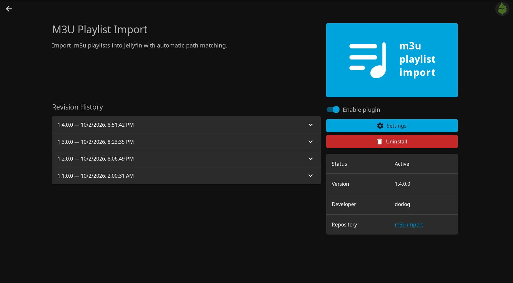
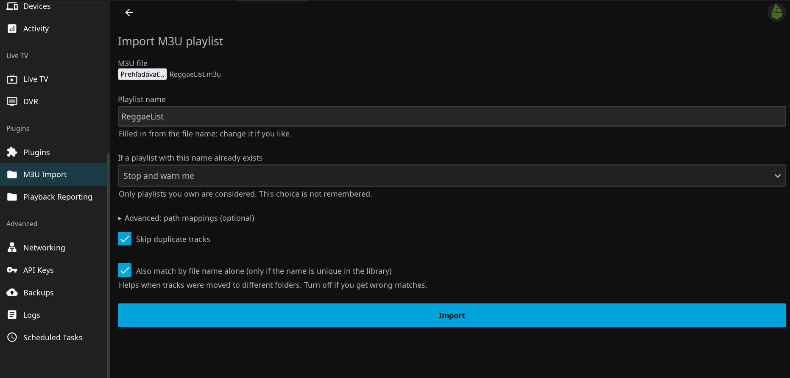

# Jellyfin M3U Playlist Import

Import `.m3u` / `.m3u8` playlists into Jellyfin as audio playlists. 

Tested with **Jellyfin 12.1**.

## Screenshots

| Plugin page | Import page |
|---|---|
|  |  |

## Features

- Matches tracks even when the music is mounted at a different path than where the m3u was made
- Handles `file://` URLs, `%20` escapes, relative paths, Windows paths and accents
- Shows exactly which lines were not found, with a hint where the library has a file with that name
- Playlist name is pre-filled from the file name
- Handles if you already have a playlist with that name: stop and warn (default), add to it, replace it, or
  create another
- Available in English and Slovak (follows your Jellyfin display language, otherwise the browser's)

**Two ways to use it:**

- **Plugin** (easiest): upload the m3u file in the Jellyfin dashboard.
- **Script** (`m3u_to_jellyfin.py`): command line, needs only Python 3 and an API key.
  
## Install the plugin from the repository

1. In Jellyfin: **Dashboard -> Plugins -> Repositories -> Add**
2. Name: `M3U Playlist Import`, URL:

       https://raw.githubusercontent.com/dodog/jellyfin-plugin-m3uimport/main/manifest.json

3. Open the **Plugins** catalogue tab, find **M3U Playlist Import**, install it, and restart Jellyfin.
4. Open **M3U Import** in the Dashboard side menu, choose your file, name the playlist, and import.

## 2nd option: Using the Python Script

    python3 m3u_to_jellyfin.py --url http://localhost:8096 --api-key KEY --m3u list.m3u --name "My list" --dry-run

Create the API key in Dashboard -> API Keys. Remove `--dry-run` to create the playlist. Options:
`--map "old=>new"` (repeatable), `--keep-duplicates`, `--no-name-only`, `--user NAME`.

## Build from source

Needs the .NET 10 SDK.

    cd Jellyfin.Plugin.M3UImport
    dotnet publish -c Release -o out

## How tracks are matched

1. The line is decoded (`file://` URLs, `%20` escapes), slashes are normalized, and optional path
   mappings are applied.
2. Exact match against the library paths (case-insensitive).
3. Same file name with the folder/file tail agreeing (e.g. `Artist/Album/Track.mp3`). Ambiguous
   matches are reported as not found rather than guessed.
4. Optional: the file name occurs exactly once in the whole library.

Lines that are not found are listed with a hint showing where the library has a file with the same
name. Path mappings (`old prefix => new prefix`) are only needed when none of the above works.

## How to translate

Translations are plain JSON files in `Jellyfin.Plugin.M3UImport/Configuration/lang/`, one per
language, named with the two-letter code (`en.json`, `sk.json`, ...).

1. Copy `en.json` to e.g. `de.json` and translate the values (keep the keys and the `{0}`, `{1}`
   placeholders as they are).
2. Create PR with your language.

